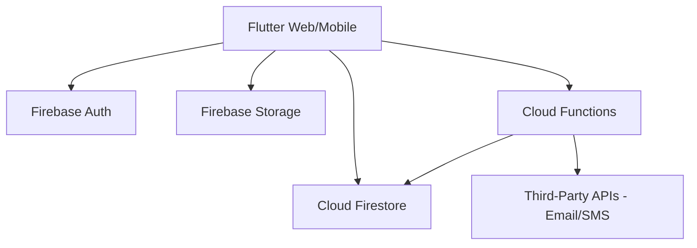
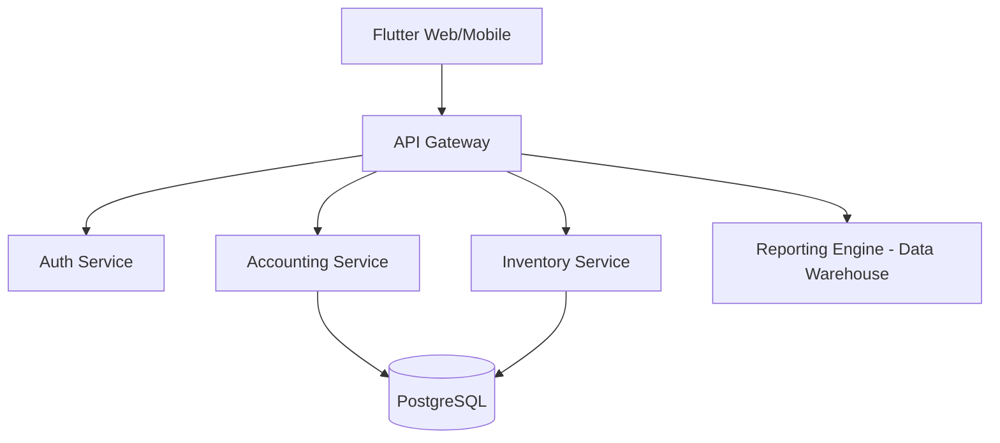

# 06 System Architecture

## Overview
LedGix ERP follows a decoupled, client-heavy architecture initially, leveraging Firebase's Backend-as-a-Service (BaaS) capabilities.

## Current Architecture (Phase 1: Firebase)

- **Frontend:** Flutter (Cross-platform).
- **Authentication:** Firebase Auth (JWT based).
- **Database:** Cloud Firestore (NoSQL, Document-based).
- **Storage:** Firebase Storage (PDFs, Images).
- **Backend Logic:** Cloud Functions (Node.js/TypeScript) for sensitive operations (e.g., posting to ledger).

## Future Enterprise Architecture (Phase 2: Microservices)

- **Language:** Go or Python for backend services.
- **Database:** PostgreSQL for relational integrity.
- **Communication:** gRPC or REST.
- **Infrastructure:** Kubernetes / Docker.

## Data Flow
1. **Request:** User submits a Sales Invoice.
2. **Validation:** Client-side validation.
3. **Transmission:** Secure write to Firestore (status: 'Draft').
4. **Processing:** Cloud Function triggers on 'Approve' to:
   - Verify inventory levels.
   - Generate Journal Entry.
   - Update account balances.
   - Update document status to 'Posted'.
5. **Notification:** Trigger push/email via Cloud Function.
